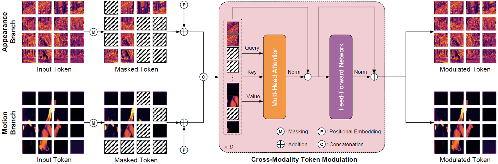
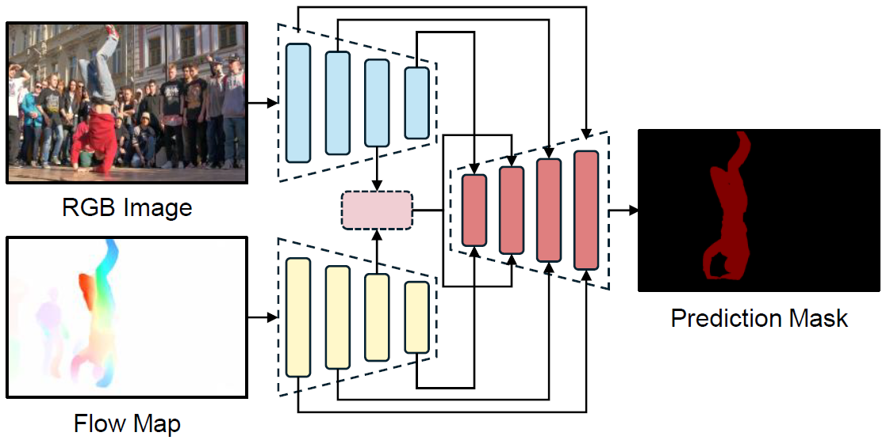
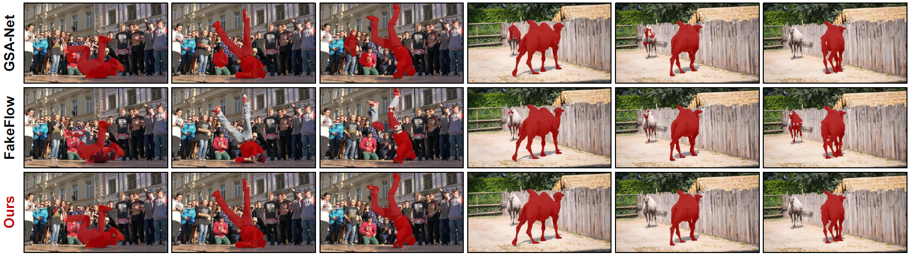

# CMTM: Cross-Modal Token Modulation for Unsupervised Video Object Segmentation

<p align="center">
IEEE International Conference on Image Processing (ICIP) 2025
<br>
<b>Oral Paper ⭐</b>
</p>

<p align="center">
<b>InSeok Jeon</b>, Suhwan Cho, Minhyeok Lee, Seunghoon Lee
<br>
Minseok Kang, Jungho Lee, Chaewon Park, Donghyeong Kim, Sangyoun Lee
</p>

<p align="center">
Yonsei University
</p>

<p align="center">
<a href="https://arxiv.org/abs/2604.14630">Paper</a>
</p>

---

## Teaser

<p align="center">
  
</p>

CMTM introduces **cross-modal token modulation** to effectively model interactions between appearance and motion cues for unsupervised video object segmentation.

---

## Overview

Recent advances in unsupervised video object segmentation have highlighted the effectiveness of two-stream architectures that integrate appearance and motion cues. However, fully leveraging these complementary sources of information requires effectively modeling their interactions.

In this paper, we propose **Cross-Modal Token Modulation (CMTM)**, a novel framework designed to strengthen the interaction between appearance and motion cues. Our method establishes dense connections between tokens from each modality, enabling efficient intra-modal and inter-modal information propagation through relation transformer blocks. To further improve learning efficiency, we introduce a token masking strategy that encourages more effective representation learning beyond simply increasing model complexity.

CMTM achieves state-of-the-art performance across all public benchmarks, outperforming previous methods.

---

## Method

<p align="center">
  
</p>

Our framework consists of:

- Appearance encoder
- Motion encoder
- Cross-modal token modulation module
- Transformer-based relation modeling
- Decoder for segmentation prediction

The proposed token modulation mechanism enables effective interaction between appearance and motion representations.

---

## Qualitative Results

<p align="center">
  
</p>

---

## Video Results

<p align="center">
  
</p>

Qualitative segmentation results of **CMTM** across challenging scenarios including fast motion, occlusion, and complex scene dynamics.

---

## Installation

### Environment

- Python 3.8+
- PyTorch
- torchvision
- numpy
- opencv-python

Install dependencies:

```bash
pip install -r requirements.txt
```

---

## Dataset Preparation

### Download the following datasets

- [DUTS](http://saliencydetection.net/duts/#org3aad434)
- [DAVIS](https://davischallenge.org/davis2017/code.html)
- [FBMS](https://lmb.informatik.uni-freiburg.de/resources/datasets)
- [YouTube-Objects](https://data.vision.ee.ethz.ch/cvl/youtube-objects)
- [Long-Videos](https://www.kaggle.com/datasets/gvclsu/long-videos)

from the official websites.

For convenience, you may download the pre-processed data from the following repository: [TransFlow](https://github.com/suhwan-cho/TransFlow/blob/main/README.md)

Organize the datasets as follows:

```text
dataset/
    DUTS/
    DAVIS/
    FBMS/
    YTOBJ/
    LVID/
```

Please modify dataset paths in the configuration file if necessary.

---

## Training

To train the model:

```bash
python run.py --train
```

---

## Evaluation

To evaluate the model:

```bash
python run.py --test
```

---

## Citation

If you find this work useful for your research, please consider citing our paper.

```bibtex
@inproceedings{jeon2025cmtm,
  title={CMTM: Cross-Modal Token Modulation for Unsupervised Video Object Segmentation},
  author={Jeon, Inseok and Cho, Suhwan and Lee, Minhyeok and Lee, Seunghoon and Kang, Minseok and Lee, Jungho and Park, Chaewon and Kim, Donghyeong and Lee, Sangyoun},
  booktitle={2025 IEEE International Conference on Image Processing (ICIP)},
  pages={1390--1395},
  year={2025},
  organization={IEEE}
}
```

---

## License

This project is released under the MIT License.

---

## Acknowledgements

This repository builds upon prior research in unsupervised video object segmentation. We thank the research community for their valuable open-source contributions. We also thank the authors of **TransFlow** for providing their publicly available implementation, which served as a strong baseline for this work.

---

## Contact

If you have any questions about the code or the paper, please feel free to contact:

**InSeok Jeon**  
Email: sunlight3919@gmail.com